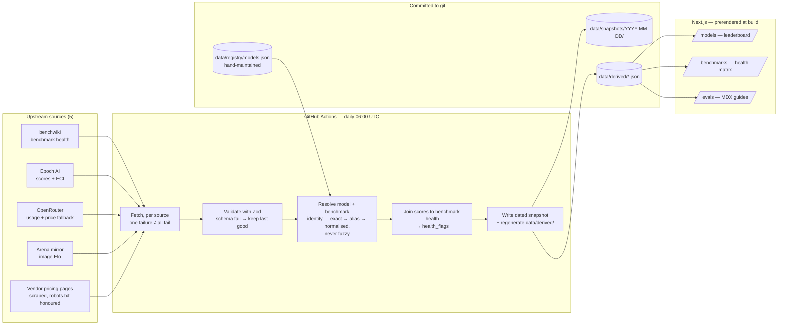
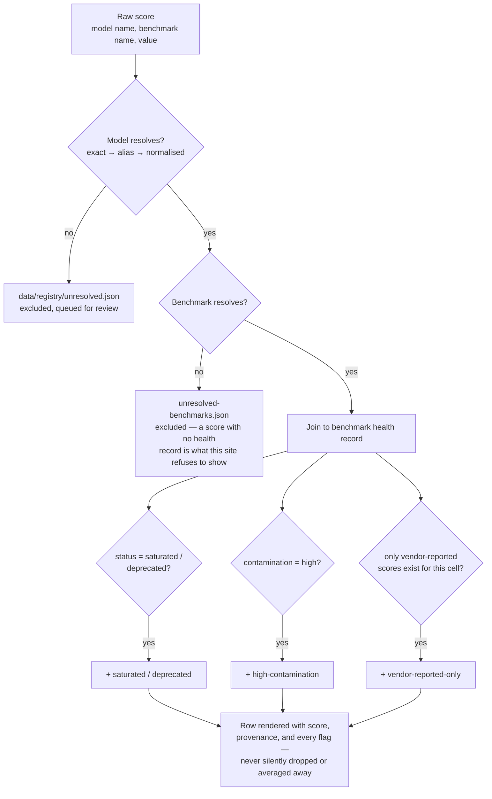

# LLM Atlas

Every other leaderboard tells you a model scored 92 on a benchmark. This site also tells
you whether that benchmark still means anything, and who reported the number.

**Live thesis:** a score without provenance and a health signal isn't a fact — it's a
number someone published. LLM Atlas joins every score to the benchmark that produced it,
carries a vendor-reported/independent label on every row, and never lets a missing value
render as a blank, a dash, or a zero. Those three rules are enforced in code, not just in
prose — see [`05-delivery/definition-of-done.md`](specs/05-delivery/definition-of-done.md).

---

## Why this exists (the product problem)

Public LLM leaderboards mix three things that shouldn't be mixed: scores from benchmarks
that have quietly saturated or gone contaminated, vendor-reported numbers presented next to
independently-run ones with no distinction, and prices that are sometimes list prices and
sometimes a router's markup — with no way to tell which is which from the page.

The product bet here is narrow on purpose. Rather than being the most complete leaderboard,
LLM Atlas is the one that tells you when a number stops being trustworthy, and shows its
work when it can't get you a number at all.

That shows up as three sections, in a deliberate reading order:

| Section | Question it answers |
|---|---|
| **Leaderboard** (`/models`) | Who is ahead right now, on a named benchmark, with the benchmark's health and each score's provenance shown beside it |
| **Benchmarks** (`/benchmarks`) | Is the test they're ahead on still measuring anything — saturation, contamination, deprecation, lineage |
| **Evals** (`/evals`) | How do *you* measure *your* application — a different discipline from ranking foundation models, and where most teams actually need help |

## What it does (functional overview)

- **Ranks models** on text, agentic, and image-generation tabs, each against a reference
  benchmark chosen by coverage → benchmark health → sample size → slug — not by whichever
  benchmark a model happens to win on.
- **Surfaces health flags** per score: `saturated`, `nearing-saturation`, `deprecated`,
  `high-contamination`, `vendor-reported-only` — computed from the join, not hand-curated.
- **Shows the Epoch Capability Index** as an explicitly labelled, independently-sourced
  column and on every model detail page, kept separate from the per-benchmark ranking it
  sits beside.
- **Prices every model** from the vendor's own pricing page where the page states a price
  unambiguously, and falls back to OpenRouter's routed price — labelled as such at the
  point of display — everywhere else. It never presents one as the other.
- **Degrades honestly.** A source that fails keeps the last good snapshot and shows a
  staleness marker instead of silently going blank. A model with no vendor price shows an
  explained gap, not a dash.

## Architecture at a glance

Static-first, no database, no runtime fetch. A scheduled job is the only thing that ever
talks to the internet; the site itself just reads committed JSON at build time.



A commit to `data/` is what triggers the Vercel deploy — every deployment is reproducible,
and every upstream change is visible as a diff in the commit history rather than a silent
mutation.

### The join: how a score becomes a flagged row

This is the core artefact (`model-benchmark-join.json`) and the part of the system with the
most product judgment baked into it.



Two rules that shaped a lot of the edge-case handling:

- **No fuzzy matching, anywhere.** A near-miss model or benchmark name does not resolve —
  it queues for a human. Silent misattribution (crediting the wrong model, or merging two
  distinct benchmarks) is worse than a visible gap.
- **A collision degrades, it doesn't pick a winner.** If two upstream benchmarks normalise
  to the same name, that name stops resolving for *both* rather than one silently shadowing
  the other, because this index is built from upstream data the site doesn't control.

## Engineering decisions worth calling out

- **Compact wire payload.** The leaderboard originally shipped each `JoinedScore`'s full
  benchmark record (statistical notes, leaderboard links, performance timeline) to the
  client on every row, across two tabs and two toggle states — 444KB and 480ms of blocking
  main-thread time for data nothing on screen used. It's now a normalised `{ TableRow[],
  TableModel lookup }` shape (`lib/leaderboard/view.ts`), which took mobile Lighthouse
  performance from the 65–83 range to 81–100. Model facts that repeat across rows — prices,
  release date — live once in a lookup rather than once per row.
- **Hydration-safe deep links.** `?tab=agentic` deep links need the client tab state to
  match the server's first paint exactly, or React throws a hydration-mismatch error.
  Solved with a `useSyncExternalStore` clock rather than a `useEffect` that sets state after
  mount.
- **The 50%-truncation guard.** If a source returns fewer than half its previous record
  count, the pipeline treats that as a failure and keeps the last good snapshot, on the
  assumption that upstream truncation is more likely than a real 50% drop in coverage.
- **Vendor scraping is scoped to what can be read without guessing.** Anthropic's pricing
  page states `Input $X / MTok, Output $Y / MTok` unambiguously and is scraped. DeepSeek's
  table splits peak/off-peak and cache-hit/cache-miss pricing, so picking one number to call
  "the" price would be a guess — it's deliberately absent rather than approximated.
  OpenAI's page 403s automated requests, which is treated as a refusal, not a bug to route
  around.
- **Licensing is a build constraint, not paperwork.** Artificial Analysis has the most
  complete single API for every modality — and its free tier doesn't grant redistribution
  rights, so it's excluded from v1 entirely; even the benchmarks it appears on render only
  as outbound links, never as a number sourced from them.

## Stack

| Concern | Choice |
|---|---|
| Framework | Next.js 16 (App Router, Turbopack), React 19 — static-first, prerendered |
| Language | TypeScript 5.9, `strict: true` |
| Styling | Tailwind CSS v4, tokenised light/dark pairs |
| Validation | Zod 4 — every ingested payload is parsed, never cast |
| Content | MDX via `next-mdx-remote`, Shiki for code blocks |
| Motion | `motion/react`, Auto-Animate — informative motion only, never decorative |
| Data store | JSON committed to the repo — no database, no runtime fetch |
| Testing | Vitest (unit), Playwright + axe-core (smoke + accessibility) |
| Scheduling | GitHub Actions cron (06:00 UTC daily) — not Vercel Cron, because the job commits |
| Package manager | pnpm |

## Repository structure

```
app/(site)/            routes: home, models, benchmarks, evals
components/            data primitives, leaderboard, benchmarks, evals, home
content/evals/         MDX guides
data/
  registry/            hand-maintained model + benchmark identity
  snapshots/YYYY-MM-DD/ dated raw ingestion output — never pruned
  derived/             build inputs regenerated each run (the leaderboard reads only this)
lib/
  schemas/             Zod schemas — the source of truth for every shape on disk
  ingest/               one module per upstream source
  join/                 score × benchmark-health join, health-flag derivation
  leaderboard/          ranking, wire-format shaping
scripts/ingest.ts      entry point for the cron job
specs/                 the actual source of truth — code is downstream of it
```

`specs/` is where every product and architectural decision is recorded before it's built.
If an implementation detail contradicts a spec, the spec wins, or gets amended first, in
the same commit. Start at [specs/README.md](specs/README.md).

## Running it

```bash
pnpm install
pnpm dev          # http://localhost:3000
```

| Script | Does |
|---|---|
| `pnpm dev` | Development server |
| `pnpm build` | Production build — every route prerendered |
| `pnpm start` | Serve the production build |
| `pnpm ingest` | Run the ingestion pipeline locally (`tsx scripts/ingest.ts`) |
| `pnpm lint` | ESLint |
| `pnpm typecheck` | `tsc --noEmit`, strict |
| `pnpm test` | Vitest |
| `pnpm e2e` | Playwright — smoke paths + accessibility audit |
| `pnpm format` | Prettier |

Copy `.env.example` to `.env.local`. No variable is required for a local build.

`/tokens` is a development reference page showing every design token in both colour
schemes side by side. It's `noindex`, excluded in `robots.txt`, and not linked from the
site.

`BENCHWIKI_MODE=link` replaces the mirrored benchmark pages with a short explanation and a
link to benchwiki. The leaderboard's health flags are unaffected, because the join reads
the committed snapshot rather than those pages.

## Status

All seven build milestones are complete. The site ingests five sources daily, joins every
score to its benchmark's health record, and serves the leaderboard, the benchmark mirror,
and the evals guides.

What's deliberately absent, and why, is written down rather than left to be discovered:

- **Adoption data.** The OpenRouter usage API needs a key that isn't configured, so the
  column reports itself unavailable instead of showing a blank.
- **Models released after May 2026 that no source has named yet.** The registry is
  hand-reviewed; unmatched names queue in `data/registry/unresolved.json` rather than being
  guessed at. See [data/registry/COVERAGE.md](data/registry/COVERAGE.md).
- **Five of the eight eval archetype guides.** The index lists which are missing.
- **Vendor list prices for most creators.** Only pages that state prices unambiguously are
  scraped; everything else falls back to OpenRouter's routed price, labelled as such.

Build order and the gate each milestone passed are in
[specs/05-delivery/milestones.md](specs/05-delivery/milestones.md) and
[specs/05-delivery/definition-of-done.md](specs/05-delivery/definition-of-done.md).

## Three rules that hold everywhere

Enforced by the definition-of-done checklist, not just stated here:

- Every displayed number traces to a source URL and a fetch date.
- Every score carries a vendor-reported or independent label. The two are never averaged.
- A missing value renders as an explained gap, never as a dash, a zero, or a blank.

## Licensing

Benchmark metadata comes from benchwiki (no published licence — treated as
permission-not-granted, with persistent attribution and canonical links back), usage data
and price fallback from OpenRouter (CC BY 4.0), benchmark results and the Capability Index
from Epoch AI (CC BY), and image-generation Elo from LMArena via an unofficial community
mirror, degrading to an empty state if that mirror is unavailable. Full attribution
requirements per source are in
[specs/02-data/sources-and-licensing.md](specs/02-data/sources-and-licensing.md) and are
not optional.
